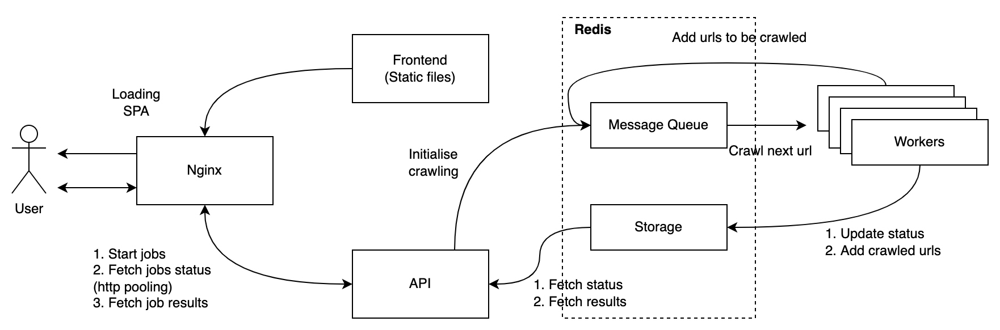

# Simple Web Crawler

## Architecture schema

## Local Deployment

**Tested on**:  
OS: MacOS 12.4  
Docker: 20.10.16  
Docker-Compose: 1.29.2  
Python: 3.10.5  
Poetry: 1.1.14  
Node: 16.15.1

1. `git clone git@github.com:smokfyz/web-crawler.git`
2. `cd web-crawler`
3. `docker-compose up`
4. Now web crawler available on `http://127.0.0.1` or `http://localhost`

## Separate component deployment

### Common steps
1. `git clone git@github.com:smokfyz/web-crawler.git`
2. `cd web-crawler`

### Redis
1. `docker run -p 6379:6379 redis`

### Backend

#### Demployment
1. `cd ./app/backend`
2. `pip install poetry`
3. `poetry shell`
4. `poetry install`
5. `python manage.py runserver`

#### Testing
1. `python -m pytest tests/`

#### Linting
1. `black backend/`
2. `isort backend/`
3. `pytest --black --flake8 --isort --mypy backend/`

### Frontend
1. `cd ./app/frontend`
2. `npm install`
3. `npm run start`

### Crawler

#### Deployment
1. `cd ./crawler`
2. `pip install poetry`
3. `poetry shell`
4. `poetry install`
5. `rq worker default` 
or `supervisord -n -c ./configs/supervisord.conf`
for multiple workers (can be set up in `supervisord.conf`)

#### Testing
1. `python -m pytest crawler/`

#### Linting
1. `black crawler/`
2. `isort crawler/`
3. `pytest --black --flake8 --isort --mypy crawler/`
